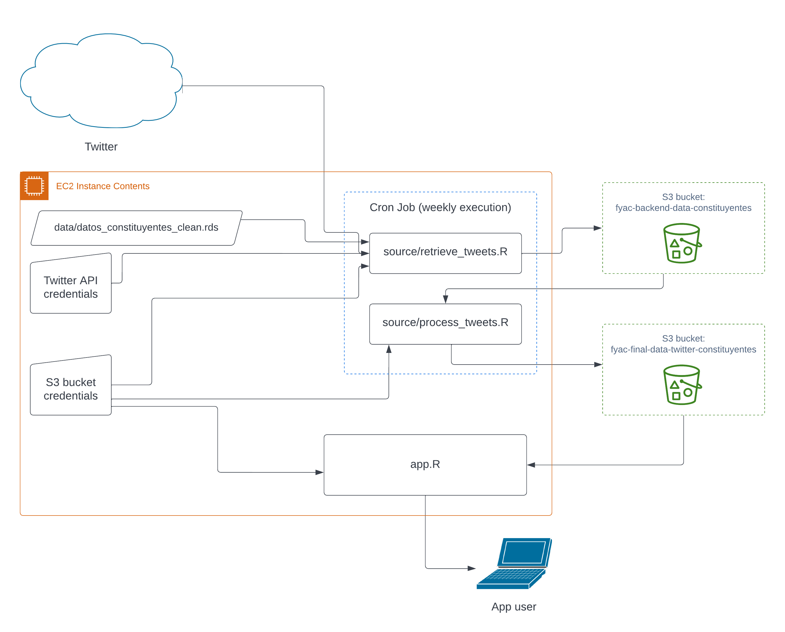

<!-- README.md is generated from README.Rmd. Please edit that file -->

# pipeline-twitter-constituyentes

This repo contains the code that runs the data pipeline for the Shiny
app
[`twitter-constituyentes`](https://github.com/franciscoyira/twitter-constituyentes).

Below there is a brief description of the most important files of this
repo, and an explanation of how they fit on the whole process:

-   :date:`data/datos_constituyentes_clean.rds`: it’s a dataframe with
    **the input data about the constituents required to run the
    pipeline**: their names, Twitter handles, and attributes/features
    that are used later on the app (gender, political coalition, age,
    etc). This file has been created by running the script
    `source/clean_datos_constituyentes.R` on
    `raw_data/datos_constituyentes.csv`.

-   :scroll:`source/retrieve_tweets.R`: runs a for loop over the Twitter
    handles of all the constituents to **retrieve their latest tweets**
    (using `rtweet::get_timeline`) and store them in an S3 bucket
    (`fyac-backend-data-constituents`). The script uses some conditional
    logic in order to make API calls that request only the necessary
    data (new tweets since the last execution of the pipeline). It
    outputs one `.rds` file per constituent per week.

-   :scroll:`source/process_tweets.R:` Retrieves all the .rds files
    stored in the bucket `fyac-backend-data-constituents` and processes
    them to create the final datasets that will be accessed by the Shiny
    app from the bucket `fyac-final-data-twitter-constituyentes`.

-   :stopwatch:`source/cronjob_pipeline.R`: just a wrapper around the
    previous two scripts that adds some information to the cron job
    logs.

-   :stopwatch:`source/setup_cronjob.R`: the script that actually set
    ups the cron job. It’s meant to be executed once on the host machine
    where the cron job should run weekly.

## Replication/deployment

This repo/pipeline is designed to be used along with
`twitter-constituyentes`. In order to deploy/replicate the whole
project, you should:

1.  Start an EC2 instance with an [RStudio
    AMI](https://www.louisaslett.com/RStudio_AMI/).
2.  Delete all the contents inside `/home/ShinyApps/`
3.  Clone `twitter-constituyentes` directly on `/home/ShinyApps/` (like,
    don’t create a subdirectory inside ShinyApps, but have the repo
    itself directly on that folder).
4.  Install `renv` and execute `renv::restore()` (this installs the
    libraries required to run the app).
5.  Then, clone `pipeline-twitter-constituyentes` directly on `/home/`
    (this time you can create a subdirectory).
6.  Change the working directory to the pipeline project and execute
    `install.packages("renv")` and `renv::restore()` again (yes, they’re
    two separate repos with separate libraries).
7.  Save the Amazon S3 and Twitter API credentials as environment
    variables (see below).
8.  Then, you can initialise the project data by running
    `source/retrieve_tweets.R` and `source/process_tweets.R` and,
    optionally, you can set up the cron job by executing
    `source/setup_cronjob.R`.

Please note that these instructions assume familiarity with Shiny
deployments on AWS AND with the RStudio AMI. If you’re new to this, I
recommend you to check [this tutorial
first](https://www.charlesbordet.com/en/guide-shiny-aws/) and also the
[RStudio AMI documentation](https://www.louisaslett.com/RStudio_AMI/).

## How to set up the credentials?

### Twitter API credentials

In order to use the Twitter API you need to register on the [Twitter
Developer Portal](https://developer.twitter.com) and create there a
project/app with the security credentials you’re going to use for this
pipeline:

-   `consumer_key`

-   `consumer_secret`

-   `access_token`

-   `access_secret`

For each of these, you can save the credentials as environment variables
by running:

`Sys.setenv("variable_name" = "variable_value")`

Then you should also:

1.  Open the script `source/set_twitter_token.R`
2.  Go to line 5
3.  Replace the value of “app” for the app/project that you created on
    the Developer Portal.
4.  Run the script after saving changes.

### Amazon S3 credentials and buckets

To set up these credentials you need to:

1.  Have an AWS account, obviously
2.  Go to the IAM Manage Console and obtain a pair of AWS_ACCESS_KEY_ID
    and AWS_SECRET_ACCESS_KEY.
3.  Then execute the following code, replacing the corresponding values
    and also indicating the **region** where the app will run (I
    deployed it on Sao Paulo to be close to Chile, but if you’re doing
    this just for fun/learning you should probably deploy to
    `us-east-1`, the most commonly used region).

<!-- -->

    Sys.setenv("AWS_ACCESS_KEY_ID" = "mykey",
               "AWS_SECRET_ACCESS_KEY" = "mysecretkey",
               "AWS_DEFAULT_REGION" = "us-east-1")

Then you also have to create two S3 buckets:

1.  One for the “backend” data: an incremental archive containing all
    the tweets retrieved from the constituents.
2.  Another for the “final” data: the processed dataframes that are
    going to be directly used by the Shiny.

Finally, you have to replace all the references to
`fyac-backend-data-constituents` with the name of your first bucket, and
the references to `fyac-final-data-twitter-constituyentes` with the name
of your second bucket.
